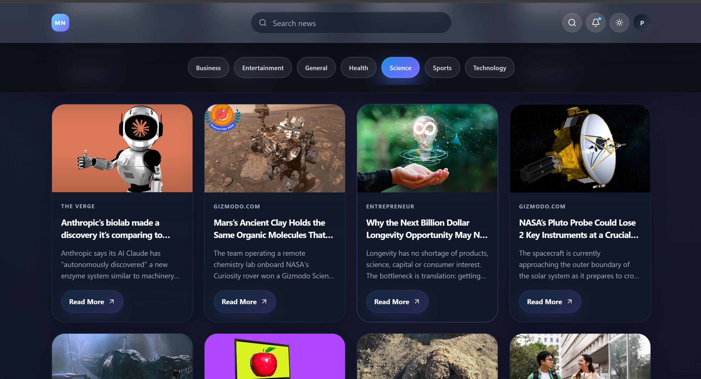
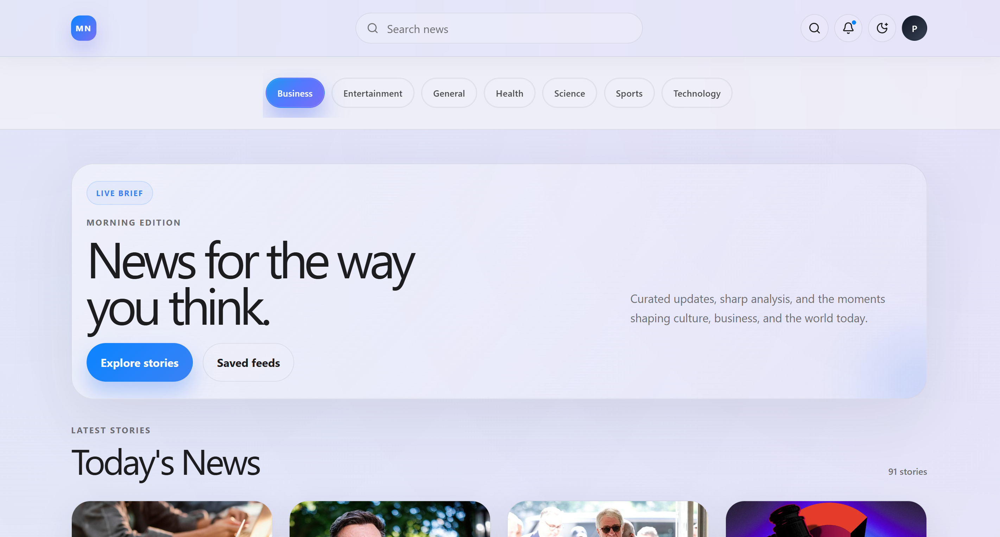

<div align="center">

# 📰 Morning News

A modern, responsive news aggregation application built with React, Vite, Tailwind CSS, and NewsAPI.


<br />

[](YOUR_LIVE_DEMO_URL)

</div>

---

## 🚀 Live Demo

👉 **Experience it here:** 🔗 [View Live Project](YOUR_LIVE_DEMO_URL)

---

## 📌 About

**Morning News** is a modern news discovery platform designed to make staying informed faster, cleaner, and more enjoyable. This project was created to practice and demonstrate real-world frontend architecture, asynchronous API integration, debounced search optimization, and theme engineering.

The application fetches dynamic news content through **NewsAPI** and provides category-based discovery, real-time search, responsive navigation, light/dark themes, custom loading states, resilient API fallback handling, and smooth micro-interactions.

---

## 🖼️ Application Preview

<div align="center">
  
  <br /><br />
  
</div>

---

## ✨ Features

### 📰 Dynamic News
Fetch and display breaking and top-headline news articles dynamically using the **NewsAPI**.

### 🔎 News Search (Debounced)
Search for specific news topics directly from the glassmorphic navigation bar. The search interaction includes a **delayed request (debounce) mechanism** to reduce unnecessary API calls while typing.

### 🗂️ Categories
Browse curated news instantly by category:
* **Business**
* **Entertainment**
* **General**
* **Health**
* **Science**
* **Sports**
* **Technology**

### 🌙 Dark / Light Mode
Switch effortlessly between light and dark themes with a smooth visual transition powered by CSS custom properties.

### 📱 Responsive Design
Designed from the ground up to work seamlessly across:
* **Desktop** (Multi-column news grid, centered search bar, full category strip)
* **Laptop** (Balanced grid spacing and fluid cards)
* **Tablet** (Adaptive grid columns and flexible navigation)
* **Mobile** (Touch-friendly controls, horizontal category scrolling, single-column layout)

### ✨ Modern UI/UX
The interface includes:
* Glass-style sticky navigation (`backdrop-filter: blur`)
* Responsive multi-column card layouts
* Animated news cards with smooth hover elevation
* Image zoom effects on card hover
* Smooth scrolling & modern editorial typography
* Subtle indigo/violet gradient accents & micro-interactions

### ⏳ Loading States
Custom skeleton/loader feedback is displayed while news data is being retrieved from the API.

### 🛡️ API Fallback
If the external NewsAPI fails, hits rate limits, or returns no articles, the application automatically provides rich fallback content so the interface remains 100% usable.

### 📭 Empty States
A dedicated, user-friendly empty state is displayed when a search query returns no valid articles.

---

## 🛠️ Tech Stack & Technology Breakdown

| Technology        | Purpose                     |
| ----------------- | --------------------------- |
| **React**         | UI development & components |
| **Vite**          | Development & build tooling |
| **JavaScript**    | Core application logic      |
| **Tailwind CSS**  | Utility-first styling       |
| **DaisyUI**       | UI component utilities      |
| **Axios**         | HTTP/API requests           |
| **NewsAPI**       | Live news data source       |
| **React Context** | Global state management     |
| **Lucide React**  | Clean vector icons          |
| **ESLint**        | Code quality & linting      |

### 🔍 Detailed Overview of Technologies Used

1. **⚛️ React (v19)**
   * Used to build a modular, component-driven user interface (`Navbar`, `Category`, `News`, `Loader`, `Footer`, `Wrapper`).
   * Leverages React Hooks (`useState`, `useEffect`, `useContext`, `useRef`) for lifecycle management, theme toggling, and debounced search timers.

2. **⚡ Vite**
   * Serves as the next-generation frontend build tool providing instant dev-server startup, Hot Module Replacement (HMR), and optimized production bundles.
   * Manages secure environment variable injection via `import.meta.env.VITE_API_KEY`.

3. **🎨 Tailwind CSS & DaisyUI**
   * **Tailwind CSS** powers the responsive grid layout (`grid-cols-1 sm:grid-cols-2 lg:grid-cols-4`), spacing, glassmorphism (`backdrop-blur`), and hover micro-interactions.
   * **DaisyUI** provides accessible UI utility classes, buttons, badges, and loading indicators that accelerate component styling.

4. **🌐 Axios**
   * Configured via a centralized `Axios.js` instance with base URLs and default timeouts.
   * Handles asynchronous `GET` requests to NewsAPI with clean `try / catch` error interception and response parsing.

5. **📰 NewsAPI**
   * External REST API used to fetch real-time top headlines and topic-specific news articles filtered by category (`science`, `technology`, `business`, etc.) or custom search keywords (`q=`).

6. **🧠 React Context API (`NewsContext.jsx`)**
   * Eliminates prop-drilling by providing centralized state across the application—storing the `news` array, `loading` boolean, active `category`, search `query`, and `fetchNews` helper function.

7. **🎯 Lucide React**
   * Supplies crisp, lightweight SVG icons for the search bar, notification bell, dark/light theme switcher (`Sun` / `Moon`), and external article links (`ArrowUpRight`).

8. **🧹 ESLint**
   * Enforces consistent JavaScript/React coding standards, catches unused variables, and ensures clean React Hook dependency arrays.

---

## 🧠 Architecture

The application follows a clean, scalable component-based React architecture:

```text
src/
│
├── Components/
│   ├── Category.jsx
│   ├── Footer.jsx
│   ├── Loader.jsx
│   ├── Navbar.jsx
│   └── Wrapper.jsx
│
├── Config/
│   └── Axios.js
│
├── Context/
│   └── NewsContext.jsx
│
├── Page/
│   └── News.jsx
│
├── assets/
│
├── App.jsx
├── App.css
└── index.css
```

---

## 🔄 Application Flow

```text
User
 │
 ▼
React UI
 │
 ├── Search
 ├── Category Selection
 └── Theme Toggle
 │
 ▼
News Context
 │
 ▼
Axios Instance
 │
 ▼
NewsAPI
 │
 ▼
News Data (or Fallback Data)
 │
 ▼
React State
 │
 ▼
News Cards
```

---

## 🔍 Search Flow (Debounced API Calls)

The search functionality uses a delayed API request approach to optimize network performance:

```text
User enters search query
        ↓
Previous timer cleared (clearTimeout)
        ↓
Wait for typing pause (Debounce)
        ↓
Trigger Axios API request
        ↓
Receive NewsAPI response
        ↓
Update NewsContext state
        ↓
Render filtered articles
```

This prevents firing unnecessary API requests on every single keystroke while the user is actively typing.

---

## 🌗 Theme Architecture

The application uses **CSS Custom Properties (Variables)** for its theme system:

```css
--page-bg
--surface
--card
--text
--muted
--border
--brand
--brand-strong
```

Instead of duplicating stylesheets, the app dynamically toggles theme classes on the root element, smoothly transitioning colors across all surfaces and cards.

---

## 🛡️ Error & Fallback Handling

The application does not completely depend on a successful external API response.

```text
NewsAPI Request
   │
   ├── Success ───────► Display live API articles
   │
   └── Failure ───────► Automatically load curated Fallback Articles
```

This guarantees a reliable, uninterrupted user experience during live portfolio demonstrations and API outages.

---

## 📱 Responsive Behavior

The application adapts its layout fluidly across viewports:

### 🖥️ Desktop
* Centered pill search bar in the header
* Full horizontal category navigation strip
* 4-column news card grid (`lg:grid-cols-4`)

### 💻 Tablet
* 2-column adaptive news grid (`sm:grid-cols-2`)
* Responsive padding and balanced card heights
* Flexible navigation controls

### 📱 Mobile
* Dedicated mobile search interaction
* Smooth horizontal scrolling for category pills
* Single-column news cards (`grid-cols-1`)
* Touch-friendly button targets

---

## 🚀 Getting Started

### Prerequisites

Make sure you have installed:
* **Node.js** (v18+ recommended)
* **npm**
* **Git**

Check your installed versions:

```bash
node -v
npm -v
```

---

## 📥 Installation

1. **Clone the repository:**

```bash
git clone YOUR_GITHUB_REPOSITORY_URL
```

2. **Move into the project directory:**

```bash
cd My-News-App
```

3. **Install dependencies:**

```bash
npm install
```

---

## 🔐 Environment Variables

Create a `.env` file in the root directory:

```env
VITE_API_KEY=your_newsapi_key
```

Replace `your_newsapi_key` with your actual API key from [NewsAPI.org](https://newsapi.org/).

> ⚠️ **Important:** Never commit your `.env` file to GitHub. Ensure `.env` is listed inside your `.gitignore`.

---

## ▶️ Run the Project

Start the Vite development server:

```bash
npm run dev
```

Vite will start a local server, typically accessible at:

```text
http://localhost:5173
```

---

## 🏗️ Production Build & Linting

Create an optimized production build:

```bash
npm run build
```

Preview the production build locally:

```bash
npm run preview
```

Run ESLint to verify code quality:

```bash
npm run lint
```

---

## 🌐 Deployment

This project can be deployed seamlessly on **Vercel**, **Netlify**, or **Render**:

```text
GitHub Repository
       ↓
Connect Repository to Hosting Provider
       ↓
Install Dependencies (npm install)
       ↓
Build Project (npm run build)
       ↓
Configure Environment Variable (VITE_API_KEY)
       ↓
Deploy Live 🚀
```

---

## 📸 Screenshots

Recommended folder structure in your repository:

```text
screenshots/
├── preview-1.png
├── preview-2.png
├── desktop-light.png
├── desktop-dark.png
└── mobile.png
```

---

## 🎯 What I Learned

Building **Morning News** helped me strengthen my practical understanding of:
* Modular React component architecture
* Global state management with React Context API
* REST API integration with Axios
* Asynchronous JavaScript (`async / await`, Promises)
* Resilient API error & fallback handling
* Debounced search optimization
* Responsive UI development with Tailwind CSS & DaisyUI
* Theme architecture using CSS Custom Properties
* Managing loading skeletons and empty states

---

## 🔮 Future Improvements

* [ ] User authentication (Login / Signup)
* [ ] Save & bookmark favorite articles
* [ ] Personalized news feed & reading history
* [ ] Pagination and infinite scrolling
* [ ] Node.js + Express + MongoDB backend proxy
* [ ] Progressive Web App (PWA) & offline reading support

---

## 👨‍💻 Author

**Piyush Pal**  
*Frontend Developer | MERN Stack Developer*

### 🤝 Connect With Me

* **GitHub:** [YOUR_GITHUB_URL](YOUR_GITHUB_URL)
* **LinkedIn:** [YOUR_LINKEDIN_URL](YOUR_LINKEDIN_URL)
* **Portfolio:** [YOUR_PORTFOLIO_URL](YOUR_PORTFOLIO_URL)
* **Email:** [piyushpal8929758598@gmail.com](mailto:piyushpal8929758598@gmail.com)

---

## 📄 License

This project is created for educational, portfolio, and demonstration purposes.

---

<div align="center">

### ⭐ If you found this project interesting, don't forget to give it a star on GitHub!

</div>